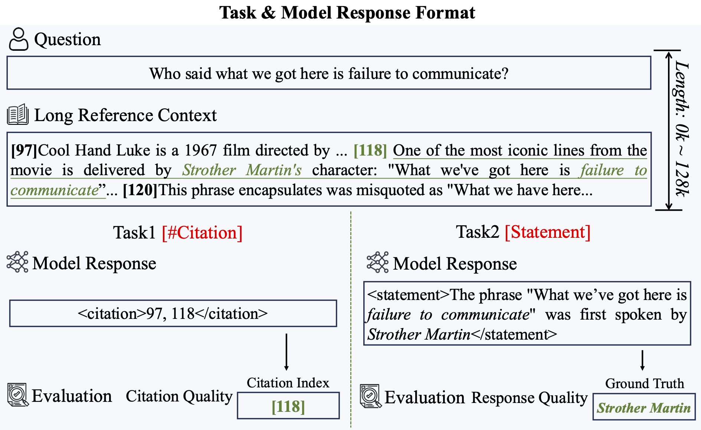

# Task 6 - 双语长上下文检索与生成的忠实度挑战

## 任务介绍

在长上下文模型 (LCM) 领域，一个关键特征是“先检索后生成”范式。模型首先隐式识别上下文中的关键信息，然后基于聚合的上下文进行生成。虽然开发长文本模型已经取得了重大进展，即模型在开源长文本基准上取得了出色的表现，但仍需要更细粒度和准确地评估它们检索相关信息和生成忠实输出的能力。此外，虽然许多开源 LCM 在英语任务中表现良好，但它们在中文任务中的表现仍然不令人满意，凸显了该领域的重大差距。为了应对这些挑战，此共享任务侧重于评估 LCM 在双语场景（中文和英文）中的两个核心功能：检索和生成。参与者需要仅使用 LCM 本身完成任务，而不依赖于检索增强生成 (RAG) 等外部模块。此共享任务包括两个Track：

* **Track 1：长上下文检索忠实度（LRF）** 。给定一个问题及其对应的长上下文，LCM 必须明确地定位并输出必要的关键信息。此 Track 评估模型从长上下文中准确识别和提取相关内容的能力，及评估其在没有外部帮助的情况下的检索能力。评估将从两个维度进行：细粒度检索（句子级别）和粗粒度检索（段落级别）。
* **Track 2：长上下文生成忠实度 (LGF)** 。此Track侧重于模型生成输出的忠实度。给定一个可能包含与现实世界知识或模型内部知识相冲突的信息的长上下文，例如最近的新闻或更新的事件，LCM 必须严格遵守提供的上下文来生成输出。该Track评估模型在不依赖内部知识或外部检索模块的情况下生成上下文准确且忠实的响应的能力。允许使用推理缩放技术来增强模型的性能。

<div align=center>  </div>

## 数据描述和任务介绍

L-CiteEval 是一个新颖的基准测试集，旨在评估 NLP 模型在处理长上下文任务中的信息检索能力和生成质量。

在长上下文环境下，模型需要有效地识别关键信息，同时忽略大量无关内容。为此，我们设计了一种基准构造方法，其中每个任务的数据集都经历了种子数据采样、填充数据筛选和长度扩展三个步骤。我们使用多个真实和合成数据源作为基础，并通过不同的填充策略扩展上下文长度，以模拟复杂的检索和推理场景。生成的测试样本长度范围在0k到128k，能够有效衡量模型的长文本理解能力。

L-CiteEval基准中有5个主要类别：单文件QA，多文件QA，摘要，对话理解和综合任务，涵盖了现实和合成任务。鉴于问题和较长的参考环境，L-Citeeval要求LCMS同时生成陈述及其支持证据（引用）。

### 中文任务：(里面的每个任务都可以计算LRF和LGF）

| ZH-Task | Name             | Supporting Fact | Interference Fact | Irrelevant context                   | Source                                     |
| ------- | ---------------- | --------------- | ----------------- | ------------------------------------ | ------------------------------------------ |
| qa1     |                  | 1               | 1-16              | Linly-AI/Chinese-pretraining-dataset | NLPCC-MH                                   |
| qa2     |                  | 2               | 1-16              | Linly-AI/Chinese-pretraining-dataset | NLPCC-MH                                   |
| qa3     |                  | 3               | 1-16              | Linly-AI/Chinese-pretraining-dataset | NLPCC-MH                                   |
| qa4     | counting star-ZH |                 |                   |                                      | https://github.com/nick7nlp/Counting-Stars |
| qa5     | yes-no questions | 2~3             | 1-16              | Linly-AI/Chinese-pretraining-dataset | NLPCC-MH                                   |

### 英文任务：(里面的每个任务都可以计算LRF和LGF）

| EN-Task | Name          | Supporting Fact | Interference Fact | Irrelevant context | Source |
| ------- | ------------- | --------------- | ----------------- | ------------------ | ------ |
| qa1     | Babilong QA1  | 1               |                   |                    |        |
| qa2     | Babilong QA2  | 2               |                   |                    |        |
| qa3     | Babilong QA3  | 3               |                   |                    |        |
| qa4     | Real_world T  |                 |                   |                    |        |
| qa4.1   | Single-Doc QA |                 |                   |                    |        |
| qa4.2   | Multi-Doc QA  |                 |                   |                    |        |
| qa4.3   | CounterFact   |                 |                   |                    |        |
| qa4.4   | NIAH          |                 |                   |                    |        |
| qa4.5   | CountingStar  |                 |                   |                    |        |

## 投稿与评估

### 投稿

投稿时请将以下材料打包为一个 `zip` 文件发送至 [xzs23@mails.tsinghua.edu.cn](mailto:xzs23@mails.tsinghua.edu.cn)：

* **提交文件** ：输出句子需要写成一个文本文件。**提交文件的格式必须与输入文件相同。具体来说，提交文件的行数必须与输入文件相同，且每行都是与输入文件中的句子对应的正确句子。**
* ****代码** ：代码文件夹应包含数据增强、数据处理、模型训练和模型推理的所有代码。**
* **Document** :
* **数据描述**：文档需要包含实验中用到的监督数据和无监督数据的简单描述，以及无监督数据的数据增强方法。
* **无监督数据分享链接** ：实验中使用的无监督数据请上传到云存储即网盘，并在文档中包含分享链接，禁止在模型训练中使用违规数据。

### 评估

为了进行评估，我们采用了基于字符的指标和基于句子的跨度级指标。我们提供“eval.py”来计算输出句子和金标答案之间的准确率、召回率和**F**0.5。

## 联系与引用

**如果您的出版物使用了我们的数据集，请引用以下文章：复制**

```
@article{tang2024citeeval,
  title={L-CiteEval: Do Long-Context Models Truly Leverage Context for Responding?},
  author={Tang, Zecheng and Zhou, Keyan and Li, Juntao and Ji, Baibei and Hou, Jianye and Zhang, Min},
  journal={arXiv preprint arXiv:2410.02115},
  year={2024}
}
```

如果您对此任务有任何疑问，请发送电子邮件至
